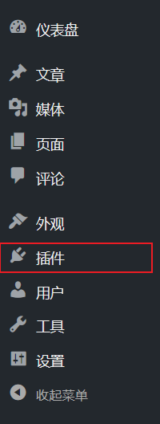
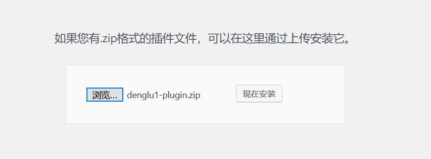
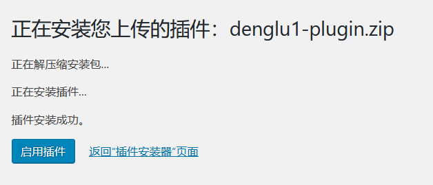
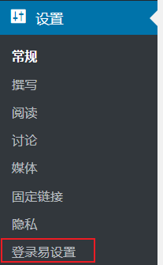
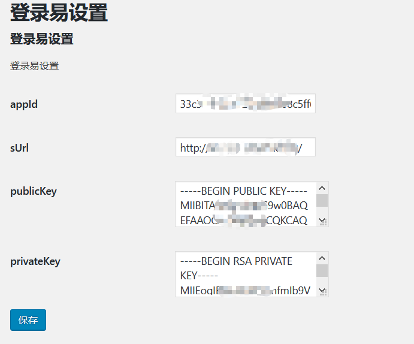
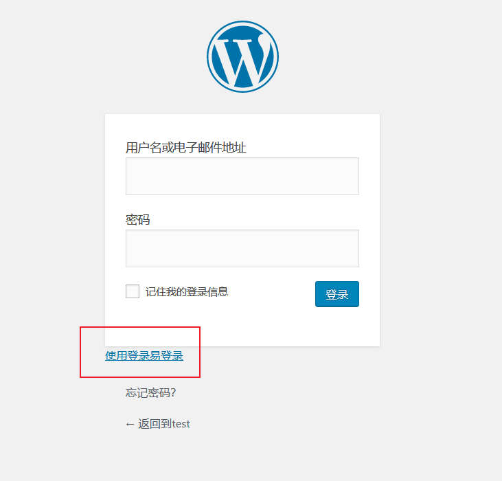

# wordpress_denglu1_plugin

使WordPress可以用登录易扫码登录

## 0x01 插件的安装

进入WordPress的管理员页面，点击`插件`

点击`安装插件`

点击`上传插件`

上传`denglu1-plugin.zip`，点击`现在安装`

上传完成后，点击`启用插件`

## 0x02 插件的设置

进入WordPress的管理员页面，点击`设置->登录易设置`

填上登录易相关信息，点击`保存`

## 0x03 使用插件

安装完成后，在登录页面点击`使用登录易登录`，进入扫码登录页面

