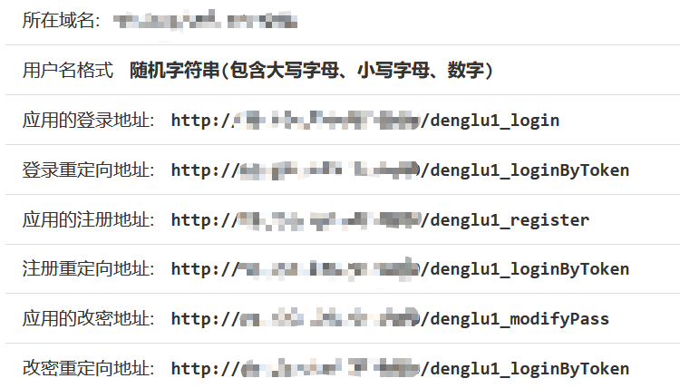

# 登录易

登录易®是一个帮用户（通过扫码或推送）自动注册、登录并管理（例如，自动修改）账号密码的软硬件产品系列，专注解决使用密码时“烧脑”“密码疲劳”等问题。用户再不需要人工设置、记忆及输入众多密码就能在各种终端上网，既方便又安全

该产品不仅仅是密码管理器，其工作原理是我们独创的基于可信用户代理的多方闭环网络身份认证机制，颠覆了现有的B/S架构用户认证机制但兼容传统账号密码系统，同时可以检测钓鱼和网络非法（包括入侵、后门等）请求

安装该插件后将使WordPress网站支持使用登录易登录，简化登录操作的同时提高安全性

# 使用教程

## 0x01 注册登录易账号

访问[登录易开放平台](https://open.denglu.net.cn/web/pages/index.html)

注册成功后选择`新增应用`，填写相关信息

登录地址、重定向地址等信息，需要按照下图的格式填写

## 0x02 插件的设置

进入WordPress的管理员仪表盘，点击`登录易设置`

填上注册登录易时使用的相关信息，点击`保存`

## 0x04 使用插件

安装完成后，在登录页面点击`使用登录易登录`，进入扫码登录页面

