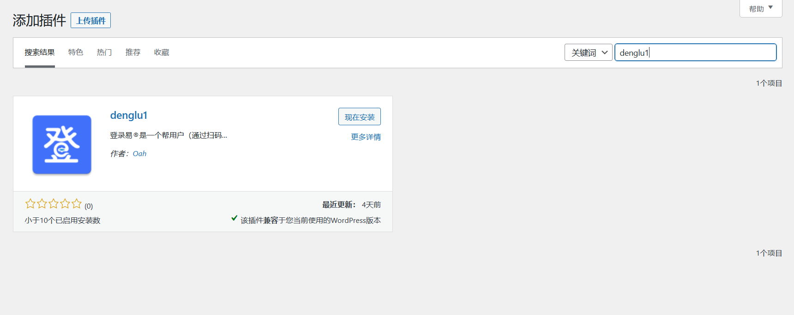
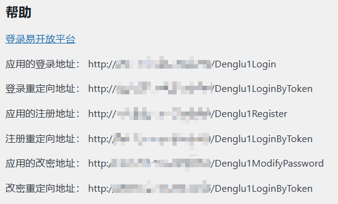
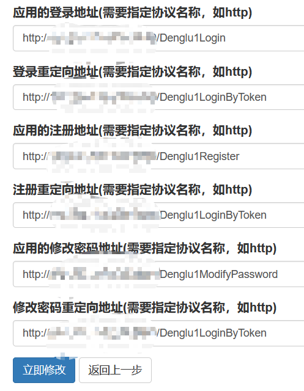
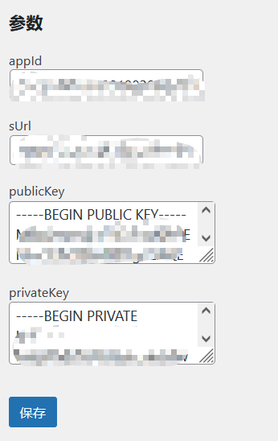
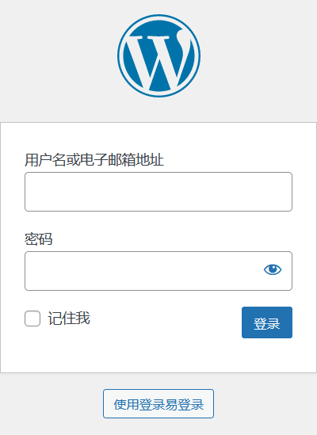

# 登录易插件使用手册

## 1 安装插件

依次进入管理员页面 -> 插件 -> 安装插件

搜索“denglu1”

点击“现在安装”，安装完成后点击“启用”

这时侧边栏会多出一项“登录易设置”，说明安装成功

## 2 插件设置

进入“登录易设置”页面，有提供帮助，这在后面的登录易开放平台中会用上

### 2.1 在登录易开放平台新增应用

访问[登录易开放平台](https://open.denglu.net.cn/web/pages/index.html)

根据网站的指示新增应用，需要注意的是下面这些内容需要按照帮助的提示来填写

全部填写完成之后就完成了登录易开放平台的设置

### 2.2 登录易插件设置

再回到“登录易设置”页面，将登录易开放平台提供的信息填入参数表单，填写完成后点击保存，就完成登录易插件的设置了

## 3 使用

进入WordPress网站的登录页面，下方新增了一个“使用登录易登录”的按钮，点击它就可以使用登录易APP扫码登录了

